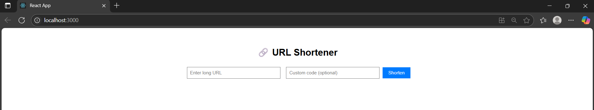

# 🔗 URL Shortener

A full-stack project built using React and Node.js to shorten URLs and track redirection with integrated logging middleware.

---

## 📸 Preview

### 🖼️ Home Page

### 🖼️ Redirect Page

---

## 🚀 Features
- URL shortening with optional custom code
- React-based clean UI
- Express backend with in-memory storage
- Middleware for logging all API activities
- Redirection support for short URLs
